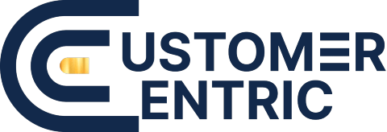

<div align="center">
  
  <h1 align="center">Centric Ecosystem</h1>
  <p align="center">Ekosistem Digital untuk Percepatan Bisnis Anda</p>
  <p align="center">
    <a href="https://customercentric.id">customercentric.id</a>
  </p>
</div>

---

## Tentang

Centric Ecosystem adalah kumpulan produk digital yang saling terintegrasi, terdiri dari 5 produk unggulan yang dirancang untuk membantu bisnis dan individu di Indonesia beroperasi lebih efisien dan tumbuh lebih cepat.

| Produk | Fungsi | URL |
|--------|--------|-----|
| **Centric Meet** | Notulensi Rapat berbasis AI | [meet.customercentric.id](https://meet.customercentric.id) |
| **Centric Hub** | WhatsApp Gateway & CRM All-in-One | [hub.customercentric.id](https://hub.customercentric.id) |
| **Centric Buzz** | Social Media Marketing Platform | [buzz.customercentric.id](https://buzz.customercentric.id) |
| **Centric Link** | LinkBackSeed Aggregator | [link.customercentric.id](https://link.customercentric.id) |
| **Centric Seekr** | Platform Karir Jobseeker AI | [doc.customercentric.id](https://doc.customercentric.id) |

## Tech Stack

| Komponen | Teknologi |
|----------|-----------|
| **Markup** | HTML5 Semantic |
| **CSS** | Tailwind CSS v3 (locally-built) |
| **JavaScript** | Vanilla JS (ES6+) |
| **Animasi** | CSS Transitions + Intersection Observer + Canvas API |
| **CMS** | Flat-file JSON (`data/content.json`) |
| **Admin Panel** | PHP (native) |
| **Deployment** | Static files via nginx (VPS) |

## Fitur Landing Page

- **Canvas Particles** — floating particles + connection lines di hero section
- **3D Tilt Cards** — product cards dengan efek perspective 3D mengikuti gerak mouse
- **Magnetic Buttons** — tombol yang "ikut" ke arah cursor
- **Animated Blobs** — background blobs morphing di hero section
- **Testimonial Carousel** — auto-slide dengan dot navigasi & prev/next buttons
- **Scroll Progress Bar** — progress bar gradient di atas halaman
- **Stagger Reveal** — animasi muncul bergantian antar elemen
- **Shimmer Border** — animated conic-gradient border pada card saat hover
- **Section Dividers** — SVG wave dividers antar section
- **Counter Animation** — angka statistik dengan count-up effect
- **FAQ Accordion** — expand/collapse interaktif
- **CMS Integration** — konten dapat diedit via file JSON + admin panel
- **SEO Ready** — sitemap.xml, robots.txt, OG/Twitter meta tags, JSON-LD structured data
- **Mobile Responsive** — layout responsive dengan mobile-first approach
- **Offline-first** — tanpa CDN dependency, semua assets lokal

## Struktur Project

```
landing-page/
├── index.html              # Halaman utama
├── tentang-kami.html       # Halaman tentang perusahaan
├── kebijakan-privasi.html  # Halaman kebijakan privasi
├── syarat-ketentuan.html   # Halaman syarat & ketentuan
├── hubungi-kami.html       # Halaman kontak
├── sitemap.xml             # XML sitemap untuk SEO
├── robots.txt              # Robots exclusion rules
├── css/
│   ├── src/
│   │   └── tailwind.css    # Source Tailwind CSS
│   └── style.css           # Built Tailwind CSS (minified)
├── js/                     # (reserved)
├── data/
│   └── content.json        # CMS content (flat-file)
├── admin/                  # PHP admin panel
├── logo/                   # Logo assets
├── favicon/                # Favicon assets
├── tailwind.config.js      # Tailwind configuration
├── package.json            # Dependencies
└── postcss.config.js       # PostCSS configuration
```

## Development

```bash
# Install dependencies
cd landing-page
npm install

# Build Tailwind CSS
npx tailwindcss -i css/src/tailwind.css -o css/style.css --minify

# Watch for changes (development)
npx tailwindcss -i css/src/tailwind.css -o css/style.css --watch
```

## Deployment

```bash
# Upload to VPS via SCP
scp -i ~/.ssh/cecebuzz_deploy landing-page/*.html root@103.245.38.81:/var/www/vhosts/customercentric.id/web/
scp -i ~/.ssh/cecebuzz_deploy landing-page/css/style.css root@103.245.38.81:/var/www/vhosts/customercentric.id/web/css/

# Fix permissions
ssh -i ~/.ssh/cecebuzz_deploy root@103.245.38.81 "chown -R customercentric:psacln /var/www/vhosts/customercentric.id/web/*.html /var/www/vhosts/customercentric.id/web/css/ /var/www/vhosts/customercentric.id/web/*.xml /var/www/vhosts/customercentric.id/web/robots.txt"
```

## Halaman

| Halaman | URL |
|---------|-----|
| Beranda | [customercentric.id](https://customercentric.id) |
| Tentang Kami | [customercentric.id/tentang-kami.html](https://customercentric.id/tentang-kami.html) |
| Kebijakan Privasi | [customercentric.id/kebijakan-privasi.html](https://customercentric.id/kebijakan-privasi.html) |
| Syarat & Ketentuan | [customercentric.id/syarat-ketentuan.html](https://customercentric.id/syarat-ketentuan.html) |
| Hubungi Kami | [customercentric.id/hubungi-kami.html](https://customercentric.id/hubungi-kami.html) |

## License

Hak Cipta &copy; 2026 Centric Ecosystem. Seluruh hak cipta dilindungi.
